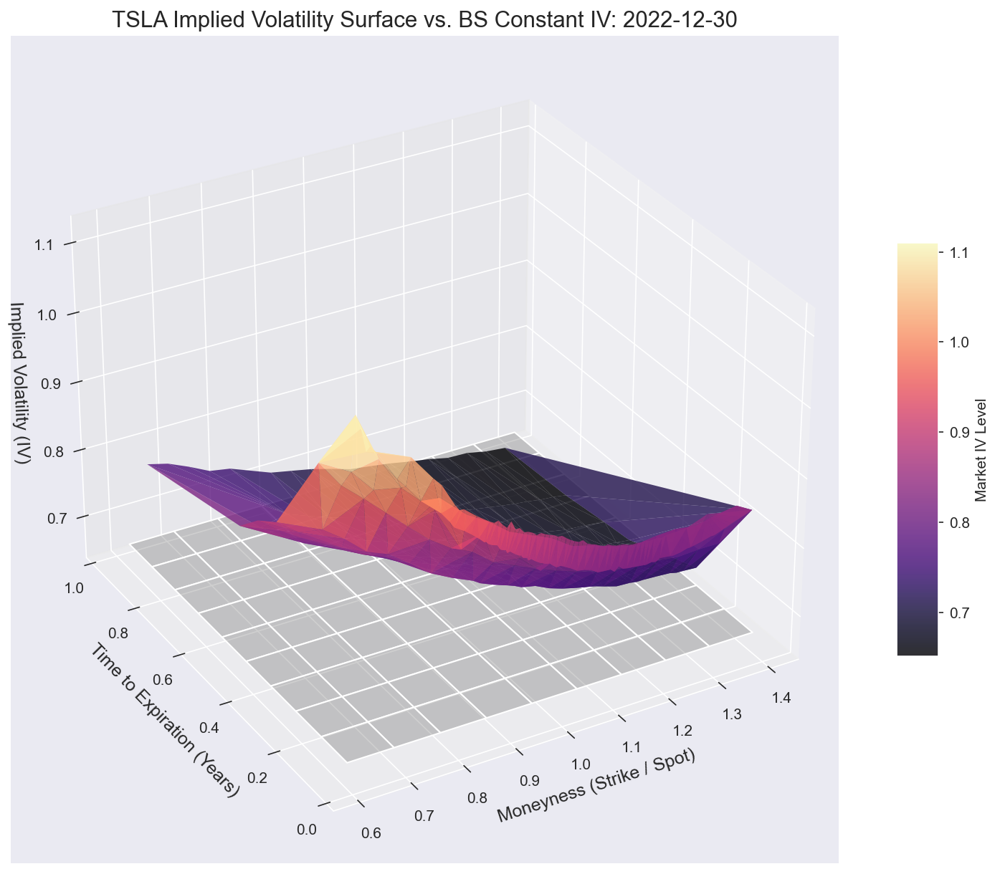

# TSLA Implied Volatility Surface
### From Raw Options Data to Market Skew and Term Structure

A quantitative finance project that builds a complete **Implied Volatility (IV) surface** for Tesla (TSLA) options from raw end-of-day data (2019–2022). The project inverts the Black-Scholes formula at scale to reveal how the options market encodes crash risk, term structure, and event-driven volatility — all of which Black-Scholes itself ignores.



---

## The Core Question

Black-Scholes assumes a single, constant volatility for all strikes and maturities. The market disagrees. This project asks:

> *What does the shape of the IV surface tell us about market fear, regime, and positioning — and what does it expose about Black-Scholes?*

---

## What This Project Does

| Step | Description |
|------|-------------|
| **Data Cleaning** | Filters 2.6M raw quotes down to 647K+ liquid, tradeable options using bid, spread, volume, and DTE criteria |
| **IV Computation** | Inverts Black-Scholes for each option using a hybrid Newton-Bisection solver (638K IVs computed) |
| **IV Surface** | 3D visualization of IV across moneyness and time to expiration vs. the BS flat-vol assumption |
| **Regime Comparison** | Side-by-side surface comparison: S&P 500 inclusion eve (Dec 2020) vs. post-crash year-end (Dec 2022) |
| **Volatility Smile** | 2D slice at fixed maturity showing the classic put skew |
| **Skew & Term Structure** | Decomposing the surface into its two key market signals |
| **Event Study** | TSLA's August 2020 stock split — tracking how the smile evolved as retail FOMO created a rare reverse skew |

---

## Key Results

- **Average IV: 66.70%** across 638K liquid TSLA options (2019–2022)
- The IV surface is **not flat** — OTM puts carry significantly higher IV (crash insurance premium)
- **Put skew dominates** in normal market conditions; the 2020 stock split produced a rare **reverse skew** driven by aggressive call buying
- **Term structure** is typically downward sloping — near-term uncertainty higher than long-term
- The **2020 vs. 2022 regime comparison** shows how the surface shape (not just level) encodes market sentiment

---

## Project Structure

```
Project/
├── Project.ipynb                                       # Main notebook — full pipeline and analysis
├── TSLA_Implied_Volatility_Surface_Presentation.pptx  # 5-slide recruiter presentation
├── TSLA_Quant_Executive_Report.docx                   # Executive summary with embedded figures
├── images/                                            # All plots generated by the notebook
│   ├── iv_surface.png
│   ├── regime_comparison.png
│   ├── volatility_smile.png
│   ├── skew.png
│   ├── term_structure.png
│   ├── smile_aug28.png
│   └── smile_evolution.png
└── README.md
```

> **Data files are not committed** (too large for GitHub). Download `tsla_2019_2022.csv` from Kaggle and run the notebook to regenerate all parquet files and images.

---

## Notebook Structure

```
1. Imports & Classes
   ├── OptionSurfacePreprocessor  — data cleaning pipeline
   └── BlackScholes               — pricing, vega, vectorized IV solver

2. Data Pipeline
   ├── Step 1: Data Cleaning      — filter raw quotes to liquid options
   └── Step 2: IV Calculation     — Newton-Bisection BS inversion at scale

3. Visualization & Analysis
   ├── Step 3: IV Surface         — 3D surface vs. BS constant-vol plane
   ├── Step 4: Regime Comparison  — Dec 2020 vs. Dec 2022
   ├── Step 5: Volatility Smile   — 2D single-expiry smile
   ├── Step 6: Skew & Term Structure — decomposing the surface
   └── Step 7: Event Study        — TSLA 2020 stock split smile evolution
```

---

## Setup

```bash
pip install numpy pandas matplotlib seaborn scipy pyarrow
```

The raw dataset is available on Kaggle:
[kylegraupe/tsla-daily-eod-options-quotes-2019-2022](https://www.kaggle.com/datasets/kylegraupe/tsla-daily-eod-options-quotes-2019-2022)

1. Place `tsla_2019_2022.csv` in the project directory
2. Run all cells in `Project.ipynb` top to bottom — this generates the parquet files and all images

---

## Technical Highlights

**IV Solver — Hybrid Newton-Bisection**
- Newton-Raphson for fast convergence in well-behaved regions
- Automatic fallback to bisection when vega < 1e-6 or Newton step escapes bounds
- Arbitrage pre-filter: rejects prices outside `(S - Ke^{-rT}, S)`
- Tolerance: 1e-8 | Max iterations: 100
- Fully vectorized over NumPy arrays — processes 647K options efficiently

**Liquidity Filter**
- Call bid > $0.50 (no penny options)
- 7 < DTE < 365 (tradeable horizon)
- |Strike distance| < 40% of spot (smile region only)
- Call volume > 0 (active trading)
- Bid-ask spread < 20% of mid (rejects stale quotes)

---

## Key Insights

1. **Black-Scholes is empirically wrong** — the market prices a smile, not a flat surface
2. **Skew encodes fear** — the put premium is a direct measure of crash risk appetite
3. **Term structure encodes timing** — elevated short-term IV signals imminent expected stress
4. **The surface is regime-dependent** — its shape shifts with market sentiment, not just its level
5. **Events distort the surface** — the 2020 split created a textbook reverse skew via retail call buying

---

## Dataset

**Source:** [Kaggle — TSLA Daily EOD Options Quotes 2019–2022](https://www.kaggle.com/datasets/kylegraupe/tsla-daily-eod-options-quotes-2019-2022)
**Author:** kylegraupe
**Coverage:** January 2019 – December 2022
**Raw size:** 2.6M option quotes
**After filtering:** 647K liquid quotes → 638K with computed IV
